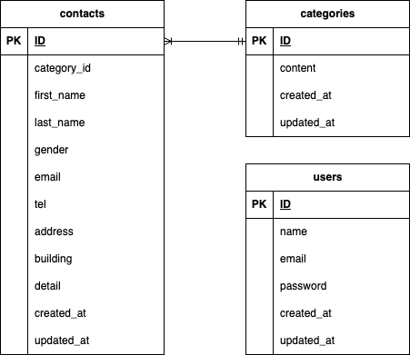

## お問い合わせフォーム

**Docker ビルド**

1. リポジトリをクローンします
   `git clone git@github.com:n-saori-code/nakanosaori-kadai-1.git`

2. DockerDesktop アプリを立ち上げる

3. 以下のコマンドで Docker コンテナをビルドして起動します
   `docker-compose up -d --build`

> ※ 一部環境でビルドエラーが出る場合は、
> `docker-compose.yml` の `platform: linux/amd64` を削除し、
> また `Dockerfile` の `FROM --platform=linux/amd64 php:8.1-fpm` を
> `FROM php:8.1-fpm` に変更してください。

---

**Laravel 環境構築**

1. コンテナに入ります
   `docker-compose exec php bash`

2. 依存パッケージをインストールします
   `composer install`

3. 「.env.example」ファイルをコピーして「.env」を作成し、DB の設定を変更してください。

```text
DB_HOST=mysql
DB_DATABASE=laravel_db
DB_USERNAME=laravel_user
DB_PASSWORD=laravel_pass
```

4. アプリケーションキーを生成します。

```bash
php artisan key:generate
```

5. マイグレーションを実行します

```bash
php artisan migrate
```

6. シーディングを実行します

```bash
php artisan db:seed
```

## ER 図



## URL

- 開発環境：http://localhost
- 管理画面：http://localhost/admin
- phpMyAdmin:：http://localhost:8080
